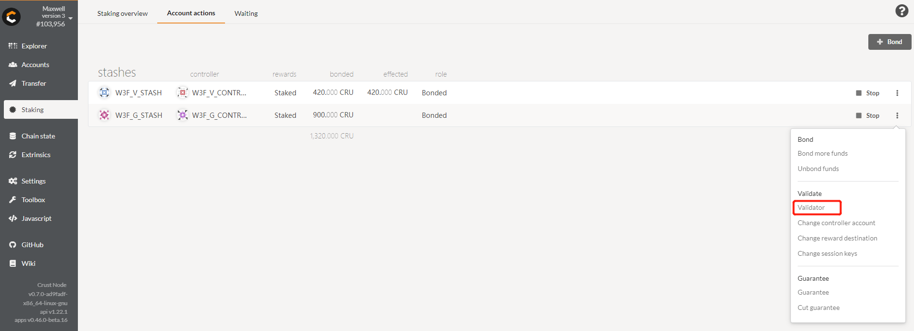
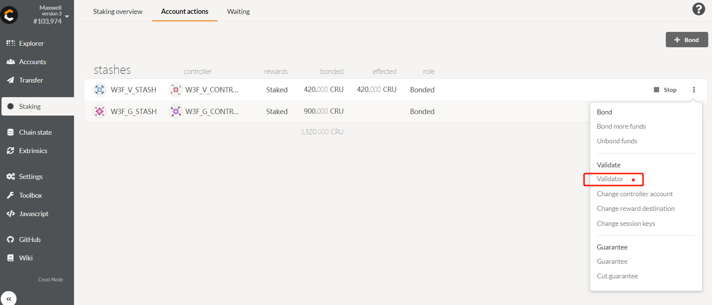
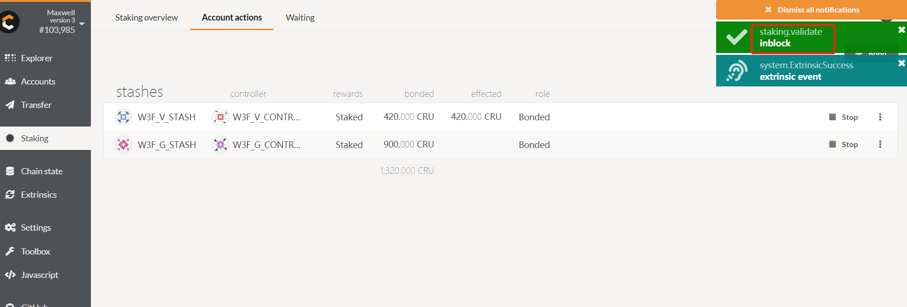
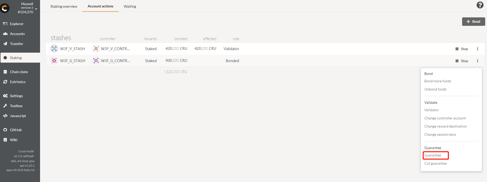
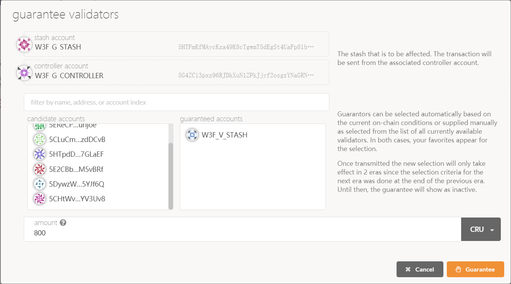
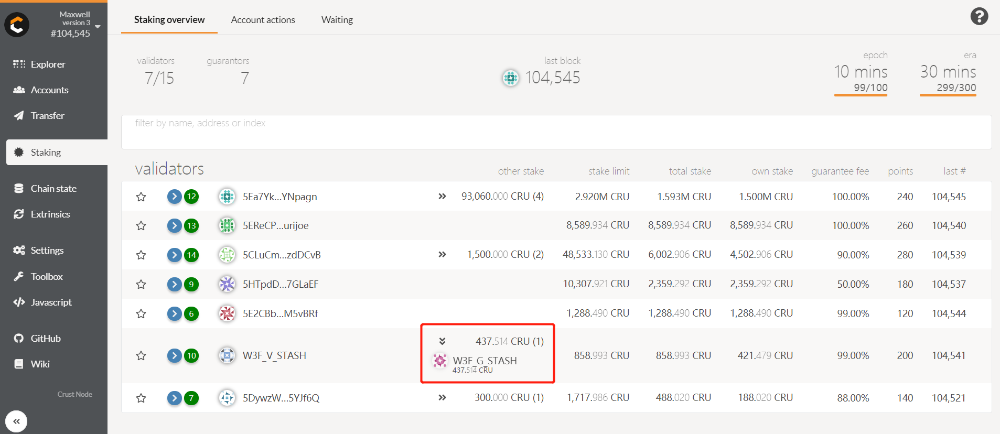
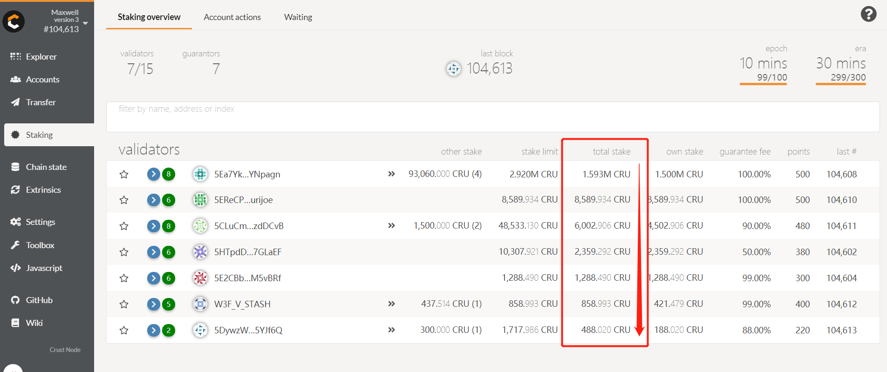

# Crust Network Milestone Deliverables

## Open Source Repos

- [Crust](https://github.com/crustio/crust)  
  The chain node which implement Crust protocol based on substrate.
- [Crust sWorker](https://github.com/crustio/crust-sworker)  
  The quantitative layer(storage and computation resources) based on TEE technology.
- [Crust API](https://github.com/crustio/crust-api)  
  The middleware layer connecting sWorker and Chain Node.
- [Crust Node](https://github.com/crustio/crust-node)  
  Official crust node service for running Crust protocol.
- [Crust Apps](https://github.com/crustio/crust-apps)
  A Portal into the Crust network based on [@polkadot/apps](https://github.com/polkadot-js/apps). Provides a view and interaction layer from a browser.

## M1 Deliverables

| Number | Deliverable                                                                                                                                                                                            | Link                                                                                                                     | Notes                                                                                                                                                                            |
|--------|--------------------------------------------------------------------------------------------------------------------------------------------------------------------------------------------------------|--------------------------------------------------------------------------------------------------------------------------|----------------------------------------------------------------------------------------------------------------------------------------------------------------------------------|
| 1      | Users will be able to **check Crust nodes' empty and meaningful storage volume and status** through Crust Apps.                                                                                    | [Look through Work Report](#1-look-through-work-report)                                                                                                 | MPoW-1: work report runtime module to quantify storage volume and monitor storage status.                                                                                        |
| 2      | Users will be able to **see nodes' TEE identity** through Crust Apps.                                                                                                                              | [Look through TEE Identity](#2-look-through-tee-identity)                                                                                                | MPoW-2: TEE (SGX solution) node onboarding and on-chain verification, nodes with SGX CPU can join Crust network                                                                  |
| 3      | Once nodes’ physical storage space changes, node owners will be able to **see nodes' storage volume automatically changes next era** through Crust explorer.                                           | [Dynamic storage change](#3-look-through-work-reports-change-when-increasing-or-reducing-storage-volumn)                                                                     | MPoW-3: dynamic storage scaling feature (including both empty and meaningful storage) to improve network availability                                                            |
| 4      | Users will be able to **check nodes’ (both validators and candidates) stake limit and valid stake** through Crust explorer.                                                                            | [Look through stake limit and valid stake](#4-validator-will-be-able-to-look-through-his-stake-limit-and-valid-stakes)                                                                                 | GPoS-1: Implement the feature to set stake limitation based on storage volume reported by MPoW work report.                                                                      |
| 5      | Users will not be able to **stake/vote exceed any node’s staking limit at any time**, and a node will **not be able to become a validator with no stake limit** claimed.                               | [Active check](#5-active-check-based-on-stake-limit)                                                            | GPoS-2: Implement active stake check based on validators and guarantors’ actions                                                                                                 |
| 6      | Users should be able to **see validator's stake limit (maybe) changed** and so his **valid stake  and his guarantor's valid stake (maybe) changed in each new era begins** through Crust explorer.     | [Passive check](#6-passive-check-based-on-stake-limit) | GPoS-3: Implement passive stake check. At the end of each era, while nodes’ stake limit could be changed according to factors like whole network storage volume and local volume |
| 7      | Users will be able to **see validator set changes(from stakes high to low order) at each era** through Crust explorer.                                                                                 | [Validator election algorithm](#7-validator-election-algorithm)                     | GPoS-4: Implement validator set election algorithm, it selects validators from high to low according to the nodes’ total stakes.                                                 |
| 8      | Users will be able to **get/put files through Crust Maxwell’s storage interfaces**. In addition, users will be able to **see the meaningful storage volume changes** accordingly through Crust explorer. | [Provide storage interface to store meaningful file](#8-providing-storage-interface-to-store-meaningful-file)              | Storage-1: Provide basic meaningful storage capabilities. Storage API will be finalized in M2. In M1 will provide basic FastDFS interfaces.                          |
| 9 | Finish **technical white paper** and publish on Crust website |  [Technical white paper](https://crust.network/whitePaper) | Documentation-1 |
| 10 | Provide **wiki** on how to explore Maxwell on GitHub. | [Crust Maxwell Wiki](https://github.com/crustio/crust/wiki/Maxwell-1.0-User-Guide) | Documentation-2 |
| 11 | Provide a basic **Github action** including building and testing on Ubuntu in crustio/crust repo | [Crust Github Action](https://github.com/crustio/crust/actions) | Open Source-1 |
| 12 | Provide a basic **Github action** building on Ubuntu in crustio/crust-sworker repo | [Crust sWorker Github Action](https://github.com/crustio/crust-sworker/actions?query=workflow%3ACI) | Open Source-2 |
| 13 | Provide a basic **Github action** including building on Ubuntu in crustio/crust-api repo | [Crust API Github Action](https://github.com/crustio/crust-api/actions?query=workflow%3A%22Yarn+CI%22) |Open Source-3

## Testing Guide

### 1. Build

#### Pull from docker hub

Or you can just pull the official images from [Docker Hub](https://hub.docker.com/u/crustio), just run

```shell
docker pull crustio/crust:0.7.0 & docker pull crustio/crust-sworker:0.5.0 & docker pull crustio/config-generator:0.1.0 & docker pull crustio/karst:0.2.0 & docker pull crustio/crust-api:0.5.0
```

#### Build docker from source

Crust including 5 parts to build docker images, you can refer the document links below to clone and build from source code:

- [Crust](https://github.com/crustio/crust/tree/master/docker#dockerize-crust)
- [Crust sWorker](https://github.com/crustio/crust-sworker#docker-model-for-developers)
- [Karst](https://github.com/crustio/karst#docker)
- [Crust API](https://github.com/crustio/crust-api#docker-launch)
- [Crust Config Generator](https://github.com/crustio/crust-node/blob/master/generator/README.md#build-docker)

### 2. Run

Please refer the [Node Setup Manual](https://github.com/crustio/crust/wiki/Maxwell-1.0-Node-Setup).

***NOTES***: We already provide you 4 accounts: `W3F Validator Controller`, `W3F Validator Stash`, `W3F Guarantor Controller` and `W3F Guarantor Stash`. **Please use these 4 accounts to run and test due to it already has CRUs inside**.

### 3. Test M1 deliverables

#### 1. Look through work report

- Step1 - Make sure you already start [Crust sWorker](https://github.com/crustio/crust/wiki/Maxwell-1.0-Node-Setup#63-start-sworker) and see your work report has been reported
- Step2 - You can look through the work report from Chain state in [Crust Apps](http://apps.crust.network/#/chainstate), like the pic shows below


#### 2. Look through TEE identity

- Step1 - Make sure you already start [Crust sWorker](https://github.com/crustio/crust/wiki/Maxwell-1.0-Node-Setup#63-start-sworker)
- Step2 - You can look through the sWorker identity from Chain state in [Crust Apps](http://apps.crust.network/#/chainstate), like the pic shows below


#### 3. Look through Work report's change when increasing or reducing storage volumn

- Increasing storage  
  - Step1 - Run command below to increase 10GB storage

  ```shell
  curl --location --request POST 'http://127.0.0.1:12222/api/v0/srd/change' --header 'backup: {"address":"5EkFb4p7R4qnGTTYbsi7mQQzL1e7D13RQwBMm49HkN6bvzjt","encoded":"0x4800d1de3925a9b792ae2497a5ed109af5eb6d8b8d46936ccee405dd661c7a5ef96c7eb263cf3bf71bd6667a2e942e4e1c78b0bee8a325da3512880882299318483deeec128acb4a0f4fc9a12638817546356017aded813a6c52a689635d7a9d420cb7c5f60ade3d0d2f4bd0f370377069d5799161b586f32e9508b5ac9d4561002b66fcbb73f3bbf6a8c006e9e9f13a726ce278221e6ecdb04c288808","encoding":{"content":["pkcs8","sr25519"],"type":"xsalsa20-poly1305","version":"2"},"meta":{"genesisHash":"0xa5bec4b73f15b4f6e99eee42778ab6754c90aeadcd2ae86aa79e9c5c7a55dd30","name":"w3f_V_controller","tags":[],"whenCreated":1596525471197}}' --header 'Content-Type: application/json' --data-raw '{"change":10}'
  ```

  - Step2 - You can look through the new work report from Chain state in [Crust Apps](http://apps.crust.network/#/chainstate)
  

- Decreasing storage
  - Step1 - Run command below to decrease 10GB storage

    ```shell
    curl --location --request POST 'http://127.0.0.1:12222/api/v0/srd/change' --header 'backup: {"address":"5EkFb4p7R4qnGTTYbsi7mQQzL1e7D13RQwBMm49HkN6bvzjt","encoded":"0x4800d1de3925a9b792ae2497a5ed109af5eb6d8b8d46936ccee405dd661c7a5ef96c7eb263cf3bf71bd6667a2e942e4e1c78b0bee8a325da3512880882299318483deeec128acb4a0f4fc9a12638817546356017aded813a6c52a689635d7a9d420cb7c5f60ade3d0d2f4bd0f370377069d5799161b586f32e9508b5ac9d4561002b66fcbb73f3bbf6a8c006e9e9f13a726ce278221e6ecdb04c288808","encoding":{"content":["pkcs8","sr25519"],"type":"xsalsa20-poly1305","version":"2"},"meta":{"genesisHash":"0xa5bec4b73f15b4f6e99eee42778ab6754c90aeadcd2ae86aa79e9c5c7a55dd30","name":"w3f_V_controller","tags":[],"whenCreated":1596525471197}}' --header 'Content-Type: application/json' --data-raw '{"change":-10}'
    ```

  - Step2 - You can look through the new work report from Chain state in [Crust Apps](http://apps.crust.network/#/chainstate)
  

#### 4. Validator will be able to look through his stake limit and valid stakes

> Make sure you have already been bonded your `Controller-Stash`, otherwise you cannot test this No.4 function.

- `Stake Limit`: After the node uploads the work report, it can immediately see the change of the stake limit from Chain state in [Crust Apps](http://apps.crust.network/#/chainstate)
  
- `Valid Stake`: In each era, user can check the `ledger` API to get the `valid stakes` value's change from Chain state in [Crust Apps](http://apps.crust.network/#/chainstate): 

#### 5. Active check based on stake limit

- `validate`: If the user wants to become a validator after bonding, the stake limit > 0
  - Step0 - Make sure you are already **bonded**
  
  
  - Step1 - When your `stake_limit == 0` and call `validate`, you will get `NoWorkloads` error(**Please use your guarantor accounts to test, because your validator accounts already have stake limit now.**)
  
  - Step2 - When your `stake_limit > 0` and call `validate`, you will validate successfully(You are already tested this function inside the Node Setup) 
  
  
  

- `guarantee`: Guarantor guarantee amount cannot exceed the validator’s stake limit(***Please make sure you are using the gurantor accounts***)
  - Step0 - Make sure you are **already bonded**
  - Step1 - Call `guarantee`, and guaranteed `Balance` > remain_stakes(stake_limit - bonded_stakes)
  
  
  - Step2 - You can see the `other stake` under `Staking` module in [Crust Apps](http://apps.crust.network/#/staking) after an era
  

#### 6. Passive check based on stake limit

> Passive check happens at the begin of each era, mainly influent (validator + guarantor)'s `stakers` and `ledger.valid`.

- If validator's stake limit goes **larger**, nothing will happen
- If validator's stake limit goes **smaller**:
  - Case1: `stake_limit > validator_bonded_stakes` and `stake_limit < total_stakes`(validator's bonded stakes + guaranteed stakes). Then:
    > TODO
  - Case2: `stake_limit < validator_bonded_stakes`. Then:
    > TODO

#### 7. Validator election algorithm

Validator Set will elect every era, you can check from Staking page in [Crust Apps](http://apps.crust.network/#/staking), they are ranking top down by their `total stake`.


#### 8. Providing storage interface to store meaningful file

> TODO